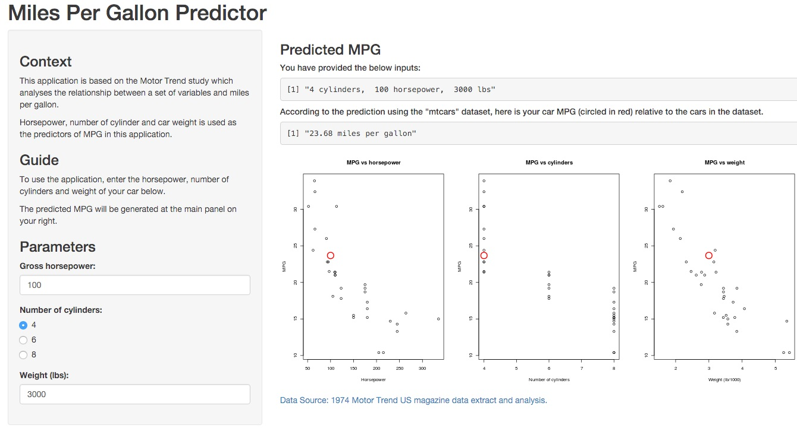

## Motivation

> This application is based on the Motor Trend study which analyses the relationship between a set of variables and miles per gallon.

> Variables that are used to quantify this relationship include:
* Horsepower, 
* Number of cylinder and 
* Car weight (in lbs)

---

## Analysis

### Data
> The data was extracted from the 1974 Motor Trend US magazine, and comprises fuel consumption and 10 aspects of automobile design and performance for 32 automobiles (1973–74 models).

> Source: [Henderson and Velleman (1981), Building multiple regression models interactively. Biometrics, 37, 391–411.](https://stat.ethz.ch/R-manual/R-devel/library/datasets/html/mtcars.html)

### Model
> Linear regression model is used to quantify the relationship between miles per gallon and the three predictors (horsepower, cylinders and weight of car).

> For more information on which predictors best predicted mileage per gallon based on Motor Trend's dataset, another study has been conducted which is available in this [link](https://github.com/kenricksetiobudi/DataProducts/tree/master/00_Documentation).

---

## Analysis

### Format

| Index | Field | Detail |
------- | ----- | ------ |
| [, 1] | mpg | Miles/(US) gallon |
| [, 2]  | cyl | Number of cylinders |
| [, 3]        | disp | Displacement (cu.in.) |
| [, 4]	| hp | Gross horsepower |
| [, 5]	| drat | Rear axle ratio |
| [, 6]	| wt | Weight (lb/1000) |
| [, 7]	| qsec | 1/4 mile time |
| [, 8]	| vs | V/S |
| [, 9]	| am | Transmission (0 = automatic, 1 = manual) |
| [,10]	| gear | Number of forward gears |
| [,11]	| carb | Number of carburetors |

--- 

## Application Interface

Here is the [link](https://kenricksetiobudi.shinyapps.io/01_Shiny) to the application.

